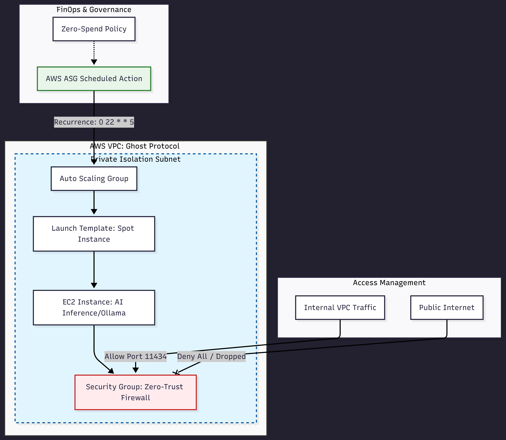

# Ghost Protocol: FinOps-First AI Infrastructure 🛡️💰



## 📄 Architectural Audit

A comprehensive technical audit of this infrastructure is available. It covers the **Hardened-by-Design** methodology, **Zero-Trust** networking, and **FinOps** cost engineering in detail.

👉 **[Download the Architectural Audit Report (PDF)](./docs/Architectural-Audit-Ghost-Protocol-Nazario.pdf)**

This repository contains a **Hardened-by-Design** infrastructure implementation using **Pulumi (Python)**. It is focused on hosting private AI inference engines (like Ollama) with a "Zero-Spend" and "Zero-Trust" philosophy.

## 🏛️ Architecture Overview

The infrastructure is designed as a **Sovereign Bunker**. It prioritizes data privacy and cost-efficiency through automated lifecycle management.

* **Network Blindage:** 100% Private Subnet isolation. No ingress from the public internet. Access is restricted to internal VPC CIDR only.
* **FinOps Engine:** Strategic use of **AWS EC2 Spot Instances**, reducing compute costs by up to 80% compared to On-Demand pricing.
* **Automated Sovereignty:** A built-in **Scheduled Action** that automatically scales the infrastructure to zero during weekends (Friday 10 PM), ensuring no wasted resources during idle periods.

## 🛠️ Stack & Methodology

* **IaC:** Pulumi (Python)
* **Cloud:** AWS (VPC, ASG, Launch Templates)
* **Methodology:** Hardened-by-Design & DevSecOps Standards
* **Workload:** Private AI Inference (Ollama-ready)

## 🚀 Key Features

### 1. The Bunker (VPC & Security)
The Security Group acts as a **Zero-Trust Firewall**. It only allows traffic on port `11434` (Ollama default) within the VPC internal range.

### 2. FinOps Automation (The Weekend Kill-Switch)
Unlike standard deployments, this code includes a `Schedule` resource:
```python
# Recurrence: "0 22 * * 5" (Every Friday at 22:00)
aws.autoscaling.Schedule("stop-weekend",
    scheduled_action_name="StopForWeekend",
    min_size=0, 
    max_size=0, 
    desired_capacity=0,
    ...)
```

## 📖 How to Deploy

To maintain environment isolation and security (Hardened-by-Design), follow these steps:

1. **Clone and Enter the Directory:**
   ```bash
   git clone [https://github.com/thiagonazario/ghost-protocol-finops.git](https://github.com/thiagonazario/ghost-protocol-finops.git)
   cd ghost-protocol-finops

2. **Setup Virtual Environment & Dependencies:**
   ```bash
   python3 -m venv venv
   source venv/bin/activate
   pip install -r requirements.txt

3. **Deploy with Pulumi:**
    ```bash
    pulumi stack init dev
    pulumi up

4. **Tear Down (FinOps Control):**
    ```bash
    pulumi destroy

⚖️ License & Intellectual Property
This project is part of my Sovereign Infrastructure Portfolio. All rights reserved. The architectural patterns (Hardened-by-Design) and FinOps strategies are intended for educational and architectural auditing purposes.
